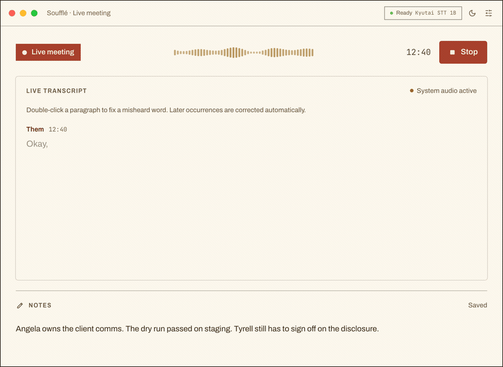
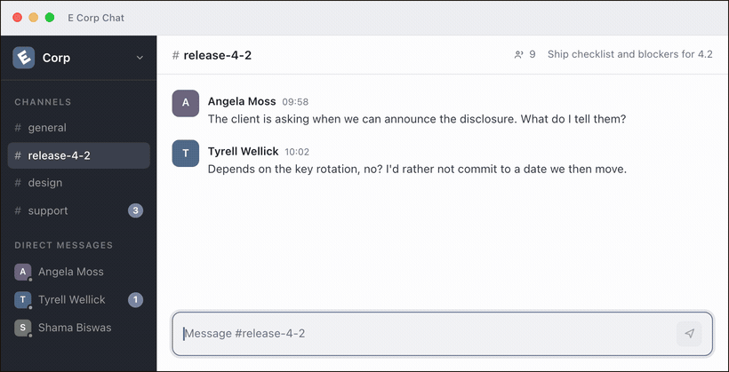
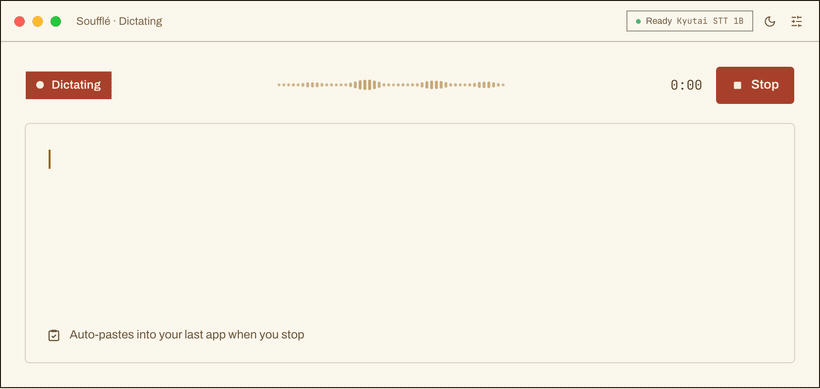
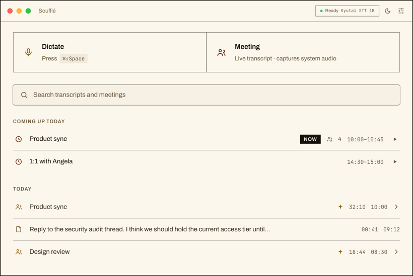

<div align="center">


<h1>Soufflé</h1>

<p><strong>Private speech-to-text for macOS that never leaves your Mac.</strong></p>

<p>
  Dictate into any app, transcribe meetings that tell your voice from everyone else's, and get<br>
  on-device summaries with decisions and action items. No cloud, no accounts, no API keys.
</p>

<p>
  
  
  
  
</p>

<p>
  <a href="#download"><strong>Download</strong></a> ·
  <a href="#meetings-that-know-who-is-talking">Meetings</a> ·
  <a href="#dictation-straight-into-the-app-you-are-already-in">Dictation</a> ·
  <a href="#requirements">Requirements</a> ·
  <a href="#speech-models">Speech models</a> ·
  <a href="#build-from-source">Build from source</a>
</p>

</div>

<p align="center">
  
</p>

## Meetings that know who is talking

System-audio capture separates **Me** from **Them** in the live transcript, with no virtual audio device to install. The recording looks after itself: it offers to start when a calendar meeting begins, notices when the meeting seems over and stops on its own after warning you, closes cleanly when the Mac sleeps and offers to resume on wake, and recovers or salvages the session if the engine stalls or the microphone disappears.

- **Live transcript** with editable notes and participants beside it.
- **Optional audio**, kept as compact Opus files for 7 days, 30 days or until you delete them, replayable with click-to-seek from any line.
- **Corrections that stick**: fix a misheard name by hand once and Soufflé keeps that spelling, in a custom dictionary you can also edit yourself.
- **A summary when you want one**, written on-device by Apple Intelligence on macOS 26 or newer, or by a local [Ollama](https://ollama.com/), with the decisions, the action items and their owners, and the questions nobody answered pulled out alongside it.

## Dictation, straight into the app you are already in

Soufflé is not a window you type into. Press the shortcut and a small pill appears above whatever you are working in; when you stop, the text lands in the field your cursor was already in. Chat, mail, an editor, a terminal: the pill does not care which, and it is excluded from screen capture, so it never turns up in the meeting you are in.

<p align="center">
  
</p>

- **Press once to start and stop**, or bind a push-to-talk key and hold it instead.
- **Insertion that fits the app**: the clipboard and ⌘V, simulated typing for terminals and secure fields that reject a synthetic paste, or a direct write through Accessibility.
- **Polish before it lands** (optional): a local LLM pass tidies the phrasing, with editable prompt templates — clean up, professional email, bullet points, remove fillers.
- **Optional start/stop sounds**, so you know the shortcut landed.

## Text arrives while you are still talking

With the default model the transcript streams in, punctuated and capitalised, instead of appearing all at once when you stop. French and English on the same model, with no language to switch.

<p align="center">
  
</p>

## Everything you record, grouped by day

Meetings and dictations land on one timeline, with today's calendar above it and full-text search across every word you have ever recorded.

<p align="center">
  
</p>

## Private by design

- 🔒 **Nothing is uploaded.** Transcription, summaries and audio all stay on your Mac, in one local database you can export or delete whenever you like.
- ✈️ **Works offline.** Once the speech model is on disk, transcription keeps working with the Wi-Fi off.
- 🙅 **No account, ever.** No sign-up, no subscription, no API key to paste in. Every outbound connection the app makes is listed [below](#what-touches-the-network).

## Own your data

- **Export any meeting** as Markdown, JSON, or SRT/VTT subtitles, or the **whole archive** as a plain folder of Markdown and JSON.
- **MCP server**: the bundled `souffle-mcp` sidecar lets Claude Desktop, Claude Code or any MCP client search and read your transcripts. Read-only, fully local, works even when the app is closed. Setup snippets live in Settings > System > Data.
- **Headless CLI**: `souffle --transcribe-file audio.wav --json` transcribes a file without launching the app, and `--repeat N` doubles as a benchmark harness.

  The `souffle` binary ships inside the app bundle and is not added to your `PATH`, so it is not a global command. Invoke it by full path, or symlink it once:

  ```bash
  # Run directly
  "/Applications/Soufflé.app/Contents/MacOS/souffle" --list-engines

  # Or expose it as a `souffle` command
  ln -s "/Applications/Soufflé.app/Contents/MacOS/souffle" /usr/local/bin/souffle
  ```

## Speech models

All models run locally and are downloaded on first use from HuggingFace:

- [Kyutai STT 1B](https://huggingface.co/kyutai/stt-1b-en_fr-candle) (default): French + English, ~2.4 GB, Metal GPU via Candle. Streams text while you speak.
- [Kyutai STT 2.6B](https://huggingface.co/kyutai/stt-2.6b-en-candle): English only, higher quality, ~5.6 GB. Streams text while you speak.
- [Whisper Large V3 Turbo](https://huggingface.co/ggerganov/whisper.cpp): multilingual, ~1.6 GB, Metal via whisper.cpp. Transcribes once you stop.
- [Parakeet TDT 0.6B v3](https://huggingface.co/istupakov/parakeet-tdt-0.6b-v3-onnx): 25 languages with punctuation and capitalization, ~670 MB int8, fast CPU inference via ONNX Runtime. Transcribes once you stop.

The two Kyutai models are the streaming ones: text appears while you are still talking. The other two transcribe the whole recording once you stop, which suits a meeting you read afterwards but changes how dictation feels.

## Requirements

- **Apple Silicon Mac.** There is no Intel build.
- **macOS 13 or newer** for dictation.
- **macOS 14.4 or newer** for meetings that capture the other participants. System-audio capture uses the Core Audio process tap, which does not exist before 14.4; on macOS 13 a meeting still records, but only your microphone, and the app shows *Mic only*.
- **Disk space for the speech model**, downloaded on first use: ~670 MB for the smallest, ~2.4 GB for the default. See [Speech models](#speech-models).
- **Summaries** need either Apple Intelligence, which requires macOS 26 or newer, or a local [Ollama](https://ollama.com/) on any supported version. Transcription itself needs neither.

## Permissions

Soufflé asks for these as you use the features that need them, never up front:

| Permission | Why | Needed for |
| --- | --- | --- |
| Microphone | Records your voice to transcribe it | Everything |
| System Audio Recording | Captures what the other participants say, without a virtual audio device | Meetings (macOS 14.4+) |
| Accessibility | Pastes into the app you were using, and reads back your corrections when "learn from edits" is on | Auto-paste, dictation polish |
| Calendar | Reads today's events to list them and offer to start recording | Calendar integration (optional) |

Settings > System > Permissions shows the current state of each and links straight to the matching System Settings pane.

## What touches the network

The privacy claim above is worth checking rather than believing, so here is every outbound connection the app makes:

- **huggingface.co**, to download a speech model the first time you select it. Nothing is sent, and once the model is on disk transcription works offline forever.
- **api.github.com**, once a day to ask whether a newer release exists, and whenever you press *Check for updates* in Settings > System > About. The daily check sends nothing but the request itself: no identifier, no account, no usage data. It shows a dialog when there is an update and never downloads or installs anything. Turn it off in Settings > System > About.
- **Your Ollama instance**, `http://localhost:11434` by default, if you enable summaries with Ollama. It is your machine unless you point it elsewhere.

Your audio, transcripts, notes and summaries are never sent anywhere. They live in a local SQLite database, and Settings > System > Data exports or deletes the lot.

## Status

Open source and actively developed. Every release is signed and notarized, and the engineering is covered by a large test suite. Macs differ enormously in audio hardware and routing, so if something does not behave on yours, a report is genuinely useful.

The fastest useful bug report is Settings > System > Diagnostics, which copies the app version, the current pipeline state and the log settings and paths, plus a live tail of the log. Paste that into a [new issue](https://github.com/damione1/souffle/issues/new/choose) with your macOS version, your Mac model and what you were doing. None of it contains transcript text, though the paths do include your user name.

## Download

Install with [Homebrew](https://brew.sh/):

```bash
brew install --cask damione1/tap/souffle
```

Or grab a prebuilt installer from the [**Releases**](https://github.com/damione1/souffle/releases/latest) page: a `.dmg` for Apple Silicon Macs. See [Requirements](#requirements) for the macOS versions.

## Build from source

Requires an Apple Silicon Mac, [Rust](https://rustup.rs/), [Node.js](https://nodejs.org/) 18+, and [cmake](https://cmake.org/) (`brew install cmake`).

```bash
npm install
npm run tauri dev
```

## License

Copyright (c) 2026 Damien Goehrig.

Released under the GNU General Public License v3.0 or later (GPL-3.0-or-later). You are free to use, study, modify, and redistribute this software, provided that derivative works are also published under the same license. See [LICENSE.md](LICENSE.md) for the full text.
