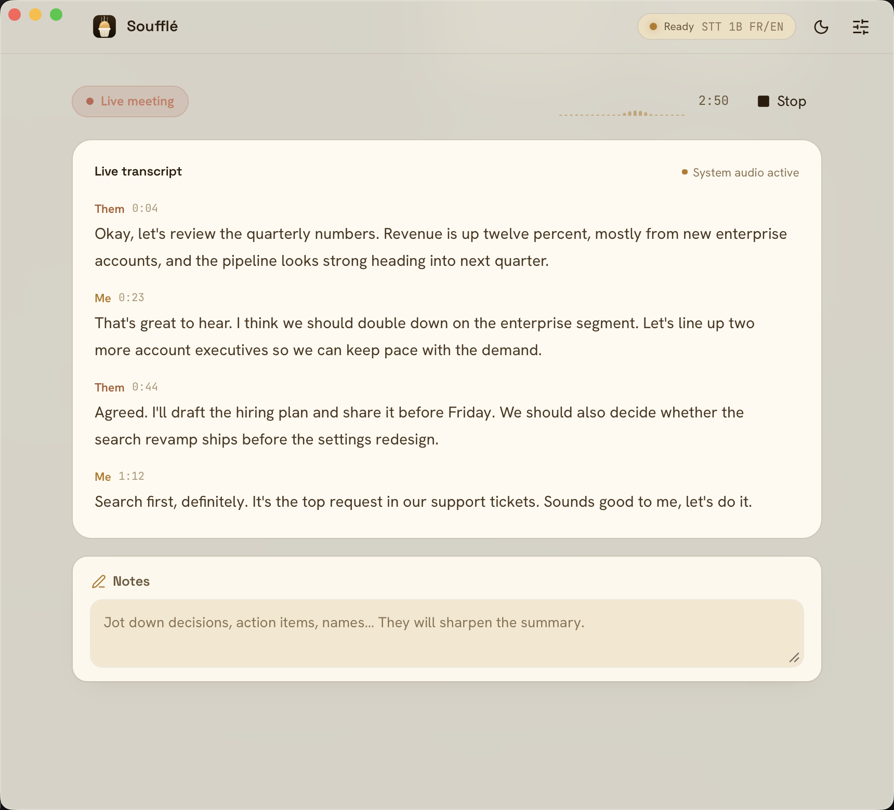
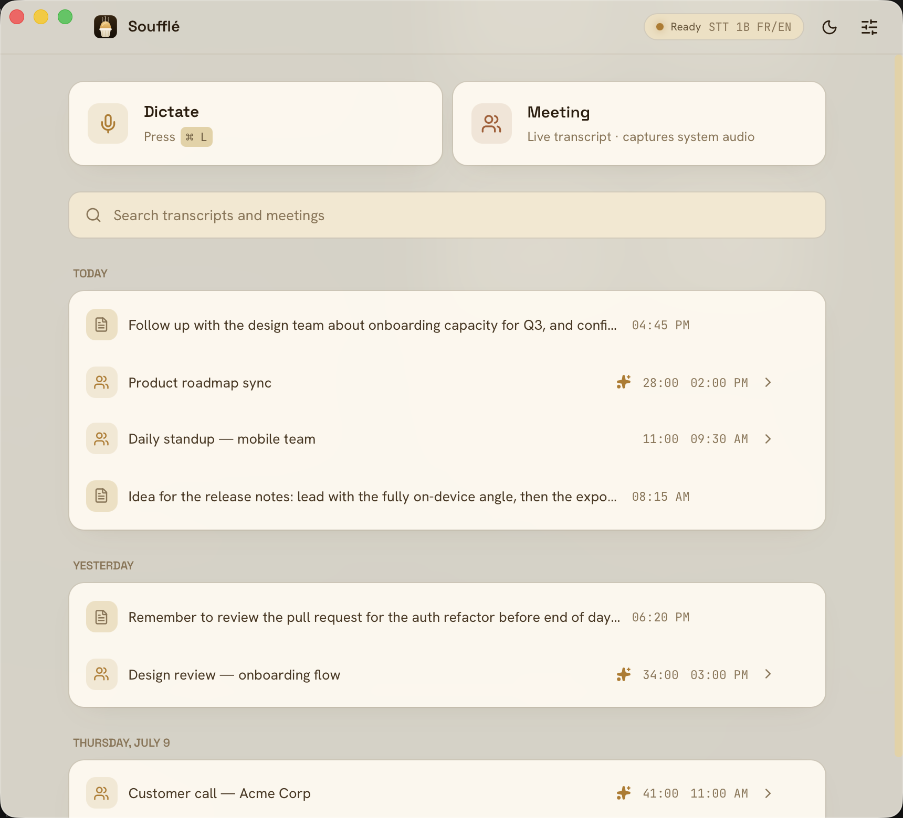
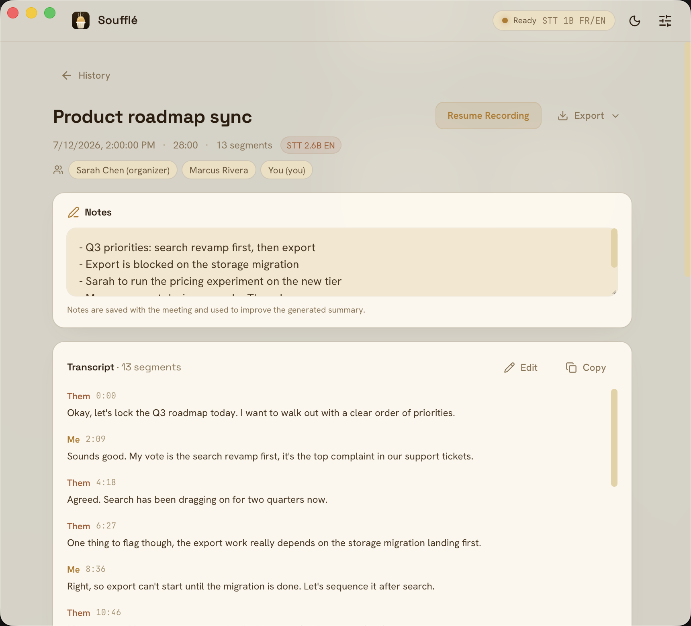

<div align="center">


<h1>Soufflé</h1>

<p><strong>Private speech-to-text for macOS that never leaves your Mac.</strong></p>

<p>
  Dictate into any app, transcribe meetings that tell your voice from everyone else's, and get<br>
  on-device summaries with decisions and action items. No cloud, no accounts, no API keys.
</p>

<p>
  
  
  
  
</p>

<p>
  <a href="#download"><strong>Download</strong></a> ·
  <a href="#requirements">Requirements</a> ·
  <a href="#permissions">Permissions</a> ·
  <a href="#speech-models">Speech models</a> ·
  <a href="#build-from-source">Build from source</a>
</p>

</div>

<p align="center">
  
</p>

Everything runs on-device:

- 🔒 **Fully private.** Transcription, summaries, and audio all stay on your Mac. Nothing is uploaded, and it works offline.
- 🎙️ **Dictation and meetings.** Talk into any app with a global shortcut and auto-paste, or capture a meeting with a live transcript that tells you apart from everyone else.
- 🧠 **Understand and own.** On-device summaries with decisions and action items, full-text search, and export to Markdown, JSON, or subtitles.

## Transcribe

- **Dictation**, with auto-paste into whatever app you were using and a global shortcut to start it from anywhere. Apps that reject synthetic paste (terminals, secure fields) can receive simulated keystrokes instead. Optional start/stop sounds confirm the shortcut landed.
- **Meeting transcription**, with a live transcript and system-audio capture that separates Me from Them. Optional audio recording keeps the meeting sound as compact Opus files with a retention policy, replayable with click-to-seek from the transcript.
- **Hands-off recording lifecycle**: the app offers to start when a calendar meeting begins, detects when the meeting seems over and stops on its own after warning you, survives lid-close and system sleep by pausing and resuming, and recovers or salvages the session if the engine stalls or the microphone disappears.

| Dictate into any app | Your timeline, grouped by day |
| :---: | :---: |
|  |  |

## Understand

- **Meeting summaries**, generated on-device by Ollama or Apple Intelligence (no setup when Apple Intelligence is available).
- **Structured outcomes**: decisions, action items with owners, and open questions extracted alongside the summary.
- **Dictation polish** (optional): a local LLM pass cleans up dictated text with editable prompt templates before pasting.
- **Full-text search** across every transcript and dictation entry.

| Transcript, notes, and participants | On-device summary and outcomes |
| :---: | :---: |
|  |  |

## Own your data

- **Export any meeting** as Markdown, JSON, or SRT/VTT subtitles, or the **whole archive** as a plain folder of Markdown and JSON.
- **MCP server**: the bundled `souffle-mcp` sidecar lets Claude Desktop, Claude Code or any MCP client search and read your transcripts. Read-only, fully local, works even when the app is closed. Setup snippets live in Settings > Data.
- **Headless CLI**: `souffle --transcribe-file audio.wav --json` transcribes a file without launching the app, and `--repeat N` doubles as a benchmark harness.

  The `souffle` binary ships inside the app bundle and is not added to your `PATH`, so it is not a global command. Invoke it by full path, or symlink it once:

  ```bash
  # Run directly
  "/Applications/Soufflé.app/Contents/MacOS/souffle" --list-engines

  # Or expose it as a `souffle` command
  ln -s "/Applications/Soufflé.app/Contents/MacOS/souffle" /usr/local/bin/souffle
  ```

## Speech models

All models run locally and are downloaded on first use from HuggingFace:

- [Kyutai STT 1B](https://huggingface.co/kyutai/stt-1b-en_fr-candle) (default): French + English streaming transcription, ~2.4 GB, Metal GPU via Candle
- [Kyutai STT 2.6B](https://huggingface.co/kyutai/stt-2.6b-en-candle): English, higher quality, ~5.6 GB
- [Whisper Large V3 Turbo](https://huggingface.co/ggerganov/whisper.cpp): multilingual, ~1.6 GB, Metal via whisper.cpp
- [Parakeet TDT 0.6B v3](https://huggingface.co/istupakov/parakeet-tdt-0.6b-v3-onnx): 25 languages with punctuation and capitalization, ~670 MB int8, fast CPU inference via ONNX Runtime

## Requirements

- **Apple Silicon Mac.** There is no Intel build.
- **macOS 13 or newer** for dictation.
- **macOS 14.4 or newer** for meetings that capture the other participants. System-audio capture uses the Core Audio process tap, which does not exist before 14.4; on macOS 13 a meeting still records, but only your microphone, and the app shows *Mic only*.
- **Disk space for the speech model**, downloaded on first use: ~670 MB for the smallest, ~2.4 GB for the default. See [Speech models](#speech-models).
- **Summaries** need either Apple Intelligence, when your Mac offers it, or a local [Ollama](https://ollama.com/). Transcription itself needs neither.

## Permissions

Soufflé asks for these as you use the features that need them, never up front:

| Permission | Why | Needed for |
| --- | --- | --- |
| Microphone | Records your voice to transcribe it | Everything |
| System Audio Recording | Captures what the other participants say, without a virtual audio device | Meetings (macOS 14.4+) |
| Accessibility | Pastes into the app you were using, and reads back your corrections when "learn from edits" is on | Auto-paste, dictation polish |
| Calendar | Reads today's events to list them and offer to start recording | Calendar integration (optional) |

Settings > Permissions shows the current state of each and links straight to the matching System Settings pane.

## What touches the network

The privacy claim above is worth checking rather than believing, so here is every outbound connection the app makes:

- **huggingface.co**, to download a speech model the first time you select it. Nothing is sent, and once the model is on disk transcription works offline forever.
- **api.github.com**, only when you press *Check for updates* in Settings > About. There is no timer and no automatic check.
- **Your Ollama instance**, `http://localhost:11434` by default, if you enable summaries with Ollama. It is your machine unless you point it elsewhere.

Your audio, transcripts, notes and summaries are never sent anywhere. They live in a local SQLite database, and Settings > Data exports or deletes the lot.

## Status

Early and actively developed. The engineering is covered by a large test suite and every release is signed and notarized, but the app has been run on very few machines, and the fragile parts are the ones that vary most from one Mac to another: audio routing, Bluetooth headsets, docks, and permission prompts. Expect rough edges there, and please report them.

The fastest useful bug report is Settings > Diagnostics, which copies the app version, the current pipeline state and the log settings and paths, plus a live tail of the log. Paste that into a [new issue](https://github.com/damione1/souffle/issues/new/choose) with your macOS version, your Mac model and what you were doing. None of it contains transcript text, though the paths do include your user name.

## Download

Install with [Homebrew](https://brew.sh/):

```bash
brew install --cask damione1/tap/souffle
```

Or grab a prebuilt installer from the [**Releases**](https://github.com/damione1/souffle/releases/latest) page: a `.dmg` for Apple Silicon Macs. See [Requirements](#requirements) for the macOS versions.

## Build from source

Requires an Apple Silicon Mac, [Rust](https://rustup.rs/), [Node.js](https://nodejs.org/) 18+, and [cmake](https://cmake.org/) (`brew install cmake`).

```bash
npm install
npm run tauri dev
```

## License

Copyright (c) 2026 Damien Goehrig.

Released under the GNU General Public License v3.0 or later (GPL-3.0-or-later). You are free to use, study, modify, and redistribute this software, provided that derivative works are also published under the same license. See [LICENSE.md](LICENSE.md) for the full text.
