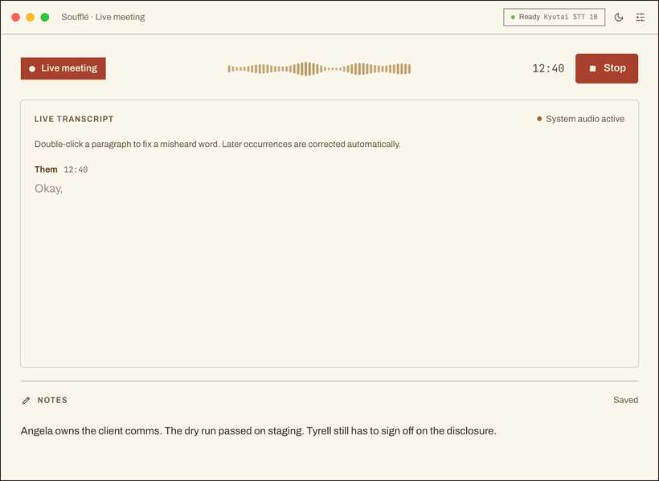
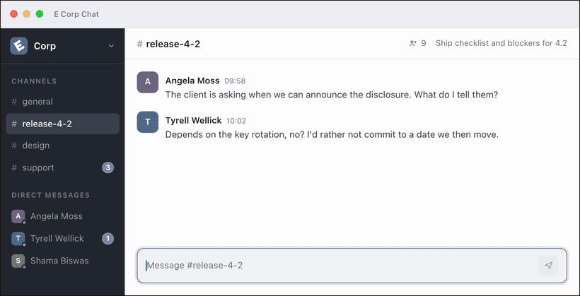
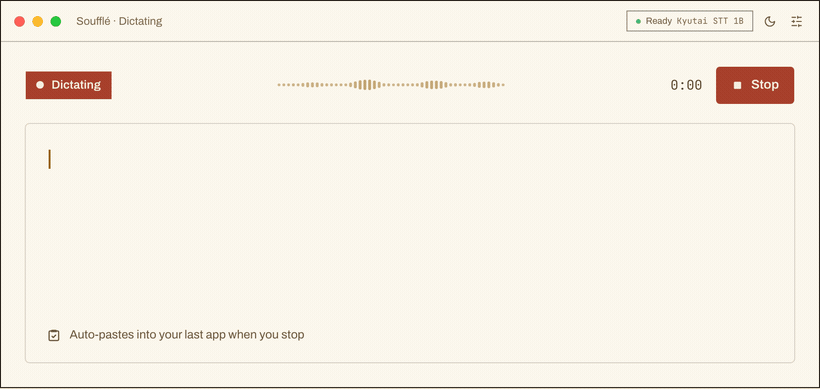
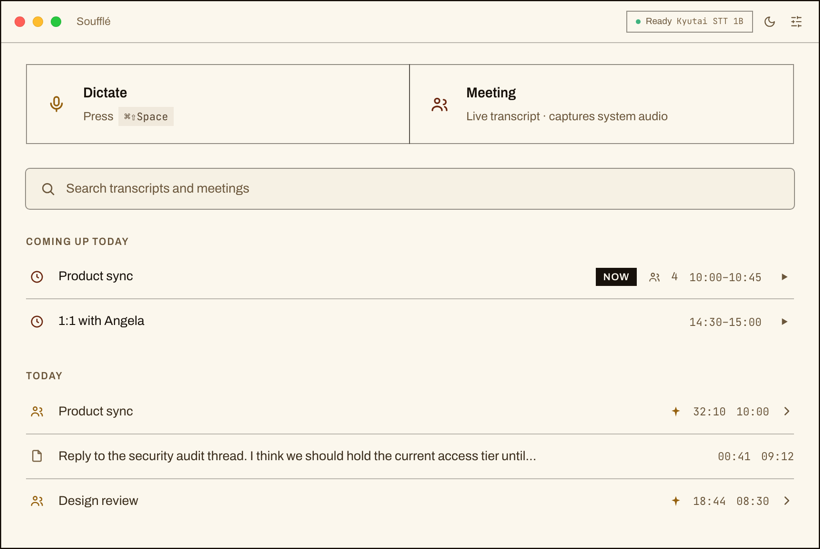

<div align="center">


<h1>Soufflé</h1>

<p><strong>Private speech-to-text for macOS that never leaves your Mac.</strong></p>

<p>
  Dictate into any app, transcribe meetings that tell your voice from everyone else's, and get<br>
  on-device summaries with decisions and action items. No cloud, no accounts, no API keys.
</p>

<p>
  
  
  
  
</p>

<p>
  <a href="#download"><strong>Download</strong></a> ·
  <a href="#meetings-that-know-who-is-talking">Meetings</a> ·
  <a href="#dictation-straight-into-the-app-you-are-already-in">Dictation</a> ·
  <a href="#requirements">Requirements</a> ·
  <a href="#speech-models">Speech models</a> ·
  <a href="#build-from-source">Build from source</a>
</p>

</div>

<p align="center">
  
</p>

## Meetings that know who is talking

System-audio capture separates **Me** from **Them** in the live transcript, with no virtual audio device to install. That separation needs a Kyutai model; Whisper and Parakeet transcribe the meeting as one mixed stream. The recording looks after itself: it notifies you when a calendar meeting begins (today's events also get a start button on Home), notices when the meeting seems over and stops on its own after warning you, closes cleanly when the Mac sleeps and offers to resume on wake, and recovers or salvages the session if the engine stalls or the microphone disappears. If a microphone stops responding, a banner offers *Restart Soufflé*.

- **Live transcript** with editable notes, and the calendar's participants, beside it. Click a word to add a dictionary alias for it.
- **Resume recording** on a stopped meeting adds another session to the same meeting.
- **From a meeting's page**: copy the summary or the transcript, export it (Markdown, JSON, SRT/VTT, or the audio as `.ogg`), or delete it. Summary templates are editable in Settings > AI.
- **Optional audio**, kept as compact Opus files for 7 days, 30 days or until you delete them, replayable with click-to-seek from any line. A meeting with system audio is stored as stereo (left = you, right = the other participants) so the two sides can be separated later, for example with `ffmpeg -map_channel 0.0.0` / `0.0.1`; the built-in player plays them mixed. Stereo costs about 1.5x the disk of a mono recording.
- **Corrections that stick**: fix a misheard name by hand once and Soufflé keeps that spelling, in a custom dictionary you can also edit yourself.
- **A summary when you want one**, written on-device by Apple Intelligence on macOS 26 or newer, or by a local [Ollama](https://ollama.com/), with the decisions, the action items and their owners, and the questions nobody answered pulled out alongside it.

## Dictation, straight into the app you are already in

Soufflé is not a window you type into. Press the shortcut and a small pill appears above whatever you are working in; when you stop, the text lands in the field your cursor was already in. Chat, mail, an editor, a terminal: the pill does not care which, and by default it is excluded from screen capture, so it does not turn up in the meeting you are in (Settings > Interface > *Hide recording overlay in screen captures*).

<p align="center">
  
</p>

- **Press once to start and stop**, or bind a push-to-talk key and hold it instead. Either shortcut can be a classic combo or a single key: a lone left or right modifier, or F5–F12. Press Esc to throw away a toggle dictation in progress, and use *Pause Shortcut (1h)* in the menu bar when you need the key for something else.
- **Voice snippets**: say a trigger phrase at the start of a dictation to paste a prepared block instead; that take skips the polish pass.
- **Insertion that fits the app**: the clipboard and ⌘V, simulated typing for terminals and secure fields that reject a synthetic paste, or a direct write through Accessibility.
- **Polish before it lands** (on by default when a provider is available): a local LLM pass tidies the phrasing, with editable prompt templates — clean up, professional email, bullet points, remove fillers.
- **Optional start/stop sounds**, so you know the shortcut landed. The menu bar can also copy the last transcription.
- **Nothing lost when a paste fails**: the text waits on Home under *Dictation to recover* until you copy or delete it.

## Text arrives while you are still talking

With the default model the transcript streams in, punctuated and capitalised, instead of appearing all at once when you stop. French and English on the same model, with no language to switch.

<p align="center">
  
</p>

## Everything you record, grouped by day

Meetings and dictations land on one timeline, with today's calendar above it, searchable by meeting title and dictation text.

<p align="center">
  
</p>

## Private by design

- 🔒 **Nothing is uploaded.** Transcription, summaries and audio all stay on your Mac, in one local database you can export whenever you like. Delete any meeting or dictation from the app; to wipe everything, quit and delete `~/Library/Application Support/com.souffle.desktop/`.
- ✈️ **Works offline.** Once the speech model is on disk, transcription keeps working with the Wi-Fi off.
- 🙅 **No account, ever.** No sign-up, no subscription, no API key to paste in. Every outbound connection the app makes is listed [below](#what-touches-the-network).
- 🚀 **Launch at login** (optional): open Soufflé automatically when you start your Mac. On by default after a fresh setup wizard.

## Own your data

- **Export any meeting** as Markdown, JSON, or SRT/VTT subtitles, or the **whole archive** as a plain folder of Markdown and JSON.
- **MCP server**: the bundled `souffle-mcp` sidecar lets Claude Desktop, Claude Code or any MCP client search and read your transcripts. Read-only, fully local, works even when the app is closed. Setup snippets live in Settings > System > Data.
- **Headless CLI**: `souffle --transcribe-file audio.wav --json` transcribes a file without launching the app, and `--repeat N` doubles as a benchmark harness.

  The `souffle` binary ships inside the app bundle and is not added to your `PATH`, so it is not a global command. Invoke it by full path, or symlink it once:

  ```bash
  # Run directly
  "/Applications/Soufflé.app/Contents/MacOS/souffle" --list-engines

  # Or expose it as a `souffle` command
  ln -s "/Applications/Soufflé.app/Contents/MacOS/souffle" /usr/local/bin/souffle
  ```

## Speech models

All models run locally and are downloaded on first use from HuggingFace:

- [Kyutai STT 1B](https://huggingface.co/kyutai/stt-1b-en_fr-candle) (default): French + English, ~2.4 GB, Metal GPU via Candle. Streams text while you speak.
- [Kyutai STT 2.6B](https://huggingface.co/kyutai/stt-2.6b-en-candle): English only, higher quality, ~5.6 GB. Streams text while you speak. It has no pause detector, so long speech without a quiet gap can lose about 2.5 seconds every 28 seconds.
- [Whisper Large V3 Turbo](https://huggingface.co/ggerganov/whisper.cpp): multilingual, ~1.6 GB, Metal via whisper.cpp. Transcribes once you stop.
- [Parakeet TDT 0.6B v3](https://huggingface.co/istupakov/parakeet-tdt-0.6b-v3-onnx): 25 languages with punctuation and capitalization, ~670 MB int8, fast CPU inference via ONNX Runtime. Transcribes once you stop.

The two Kyutai models are the streaming ones: text appears while you are still talking. The other two transcribe the whole recording once you stop, which suits a meeting you read afterwards but changes how dictation feels.

## Requirements

- **Apple Silicon Mac.** There is no Intel build.
- **macOS 13 or newer** for dictation.
- **macOS 14.4 or newer** for meetings that capture the other participants. System-audio capture uses the Core Audio process tap, which does not exist before 14.4; on macOS 13 a meeting still records, but only your microphone, and the app shows *Mic only*.
- **Disk space for the speech model**, downloaded on first use: ~670 MB for the smallest, ~2.4 GB for the default. See [Speech models](#speech-models).
- **Summaries** need either Apple Intelligence, which requires macOS 26 or newer, or a local [Ollama](https://ollama.com/) on any supported version. Transcription itself needs neither.

## Permissions

The setup wizard has an optional Permissions step; skip it and Soufflé asks for each of these as you use the feature that needs it. Notifications are the exception, requested at launch:

| Permission | Why | Needed for |
| --- | --- | --- |
| Microphone | Records your voice to transcribe it | Everything |
| System Audio Recording | Captures what the other participants say, without a virtual audio device | Meetings (macOS 14.4+) |
| Accessibility | Pastes into the app you were using, reads back your corrections when "learn from edits" is on, and installs the native event tap for single-key shortcuts (lone modifier, F5–F12) | Auto-paste, dictation polish, single-key shortcuts |
| Calendar | Reads today's events to list them on Home and notify you when one starts | Calendar integration (optional) |
| Notifications | Calendar reminders, a meeting about to stop on its own, a paste that failed | Those alerts only |

Settings > System > Permissions shows the current state of each and links straight to the matching System Settings pane.

## What touches the network

The privacy claim above is worth checking rather than believing, so here is every outbound connection the app makes:

- **huggingface.co**, to download a speech model the first time you select it. Nothing is sent, and once the model is on disk transcription works offline forever.
- **api.github.com**, once a day to ask whether a newer release exists, and whenever you press *Check for updates* in Settings > System > About; it also fetches the release notes shown in What's New. The check sends nothing but the request itself: no identifier, no account, no usage data. Turn the daily check off in Settings > System > About.
- **github.com**, only if you press *Download update*: the signed update is fetched and verified before *Install and restart* is offered, and installing asks you to stop a running meeting first.
- **Your Ollama instance**, `http://localhost:11434` by default, if you enable summaries with Ollama. It is your machine unless you point it elsewhere. A model you download from Settings > AI is pulled by that instance, not by Soufflé.

Your audio, transcripts, notes and summaries are never sent anywhere. They live in a local SQLite database: Settings > System > Data exports the lot, and deleting the data folder removes it.

## Status

Open source and actively developed. Every release is signed and notarized, and the engineering is covered by a large test suite. Macs differ enormously in audio hardware and routing, so if something does not behave on yours, a report is genuinely useful.

The fastest useful bug report is Settings > System > Diagnostics, which copies the app version, the current pipeline state and the log settings and paths, plus a live tail of the log. Paste that into a [new issue](https://github.com/damione1/souffle/issues/new/choose) with your macOS version, your Mac model and what you were doing. None of it contains transcript text, though the paths do include your user name.

## Download

Install with [Homebrew](https://brew.sh/):

```bash
brew install --cask damione1/tap/souffle
```

Or grab a prebuilt installer from the [**Releases**](https://github.com/damione1/souffle/releases/latest) page: a `.dmg` for Apple Silicon Macs. See [Requirements](#requirements) for the macOS versions.

## Build from source

The app is Rust with a native [Slint](https://slint.dev/) interface (`app/souffle-slint`), plus a little Swift for the overlay. There is no Node.js, webview or npm step. Requires an Apple Silicon Mac, [Rust](https://rustup.rs/), the Xcode command-line tools, and [cmake](https://cmake.org/) (`brew install cmake`).

```bash
git clone https://github.com/damione1/souffle.git
cd souffle
make nightly
```

`make nightly` builds and opens **Soufflé Nightly** (`com.souffle.desktop.nightly`), a debug build that sits next to the installed app with its own TCC rows; run it again after a code change. `make nightly-fresh` wipes Nightly's data and permissions first. `./scripts/bundle-macos.sh` builds a signed release bundle (see the script's header for `--dmg`, `--notarize` and the other flags).

### Replaying meeting audio through AEC

Settings > Audio > Advanced Audio offers **Pre-AEC diagnostic capture**, off by default. Enable meeting-audio retention in Data first; the diagnostic setting never enables recording by itself. Changes apply to the next session. Each recorded session gets a separate `<index>.pre-aec.wav` beside `<index>.ogg`: lossless float32 stereo at 48 kHz, left = microphone, right = system tap, sampled on the mixer's clock before echo cancellation and mixing. An unavailable source is silence. When system capture is disabled, the optional mic copy is resampled to the same clock independently, with a silent right lane. The principal recording keeps its existing mono or diarized stereo layout.

This debug audio makes each participant's lane easy to isolate. It costs about **1.38 GB/hour**, or **806 MB for 35 minutes**. Capture stops after the first hour and keeps that aligned prefix; it does not stop the meeting. The writer checks free disk space before starting and every captured second, stopping diagnostics before using a 256 MiB reserve. Concurrent disk use by other processes can still exhaust the primary recording's space. The artifact follows meeting-audio retention without extending the primary recording's age. It is published only after audio capture ends and engine startup succeeds; stopping during startup keeps it private until that result arrives, and failed startup discards it. A failed or saturated diagnostic writer discards the diagnostic, while the meeting continues. Files ending in `.partial` are unfinished and cannot be replayed.

```bash
"/Applications/Soufflé.app/Contents/MacOS/souffle" --aec-replay /absolute/path/0.pre-aec.wav
```

Replay feeds the right lane as render, then the left lane as capture through the existing mixer/AEC, without loading a transcription model or reading settings. JSON reports the captured frame count, estimated **input-to-output pipeline delay** (16-sample resolution, up to 200 ms), raw ERLE and delay-compensated ERLE. In real meetings these ERLE fields are **mic/output energy attenuation proxies**, not isolated echo removal or near-end voice distortion: no separate voice ground truth exists. Compensation compares overlapping samples after aligning output to input. The bounded measurement window is the final quarter of the last eight seconds; silence gives zero dB and an unavailable delay estimate. Synthetic fixtures use the same evaluator with their known near-end voice subtracted from capture/output.

## License

Copyright (c) 2026 Damien Goehrig.

Released under the GNU General Public License v3.0 or later (GPL-3.0-or-later). You are free to use, study, modify, and redistribute this software, provided that derivative works are also published under the same license. See [LICENSE.md](LICENSE.md) for the full text.
